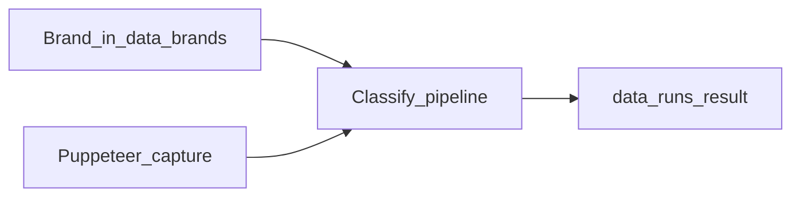

# Classification Engine POC

Scrape a suspect domain, compare it to a registered brand, and classify abuse type (Phishing, Scam, Impersonation, Gambling, Official, Access Denied, and others).



## Prerequisites

- **Node.js 18+**
- Network access (Puppeteer downloads Chromium on `npm install`; BytePlus APIs for semantic matching, LLM, logo detection, and translation)

No Python is required. Text chunking runs in-process via `src/analysis/textChunker.js`.

## Setup

```powershell
git clone https://github.com/KuokHao/Classification_engine_POC.git
cd Classification_engine_POC
git checkout development

npm install
copy .env.example .env
```

Edit `.env` and set your BytePlus key:

```text
ARK_API_KEY=your-key-here
```

Optional: set `SKIP_SEMANTIC_MODEL=true` to run without BytePlus embeddings (heuristics + KBS still work; logo/LLM/translate degrade).

### Models

Edit model IDs and endpoints in one place: [`config/config.js`](config/config.js) (`LLM_MODEL`, `TRANSLATION_MODEL`, `EMBEDDING_MODEL`, and the Ark URLs). Keep the API key in `.env`.

## Run analysis

1. Open `src/cli/runAnalysis.js` and edit the `CONFIG` object at the top:

```js
const CONFIG = {
  domain: "seiyuumobile.xyz", // suspect domain or URL
  brandId: "umobile",         // must exist in data/brands.json
  scrape: true,               // false → reuse temp/<hostname>.txt
  skipSemantic: false,        // true → skip BytePlus embeddings
};
```

2. Run:

```powershell
npm run analyze
```

Equivalent: `node src/cli/runAnalysis.js`

### Where results go

- **Verdict / stages:** `data/runs/<hostname>_<timestamp>/`
  - `10_result.json` — final abuse type, confidence, path
  - `00_meta.json` — run parameters
  - `02_capture.json` — scrape metadata
- **Last capture:** `temp/<hostname>.txt` (+ optional `.png`, `.rendered.txt`, `.capture.json`)

Both `temp/` and `data/runs/` are local/generated and not committed.

## Register a brand

Brands live in `data/brands.json`. The repo ships with `umobile` and a reference logo at `data/logos/umobile.jpg`.

```powershell
npm run register-brand -- brand.json
```

Example `brand.json`:

```json
{
  "brandName": "umobile",
  "officialSite": "u.com.my",
  "whitelistDomains": ["u.com.my"],
  "logoPath": "data/logos/umobile.jpg",
  "brandNames": ["umobile"]
}
```

Use a **relative** `logoPath` under the repo (e.g. `data/logos/yourbrand.jpg`), not a machine-specific absolute path.

## Tests

```powershell
npm test
```

Offline unit tests (includes text chunker). Live translation tests need a key:

```powershell
npm run test:translate
```

## HTTP API (optional)

```powershell
npm start
```

- `GET /health`
- `POST /classify` — body must include `url` (and usually `html` / brand fields)
- `POST /classify/batch` — `{ "jobs": [ ... ] }`

Default port: `3000` (override with `PORT` in `.env`).

## Folder map

| Path | Role |
|------|------|
| `src/analysis/` | Classification pipeline (HTML, findings, JS text chunker, semantic, KBS, LLM, logo) |
| `src/collection/` | Puppeteer capture, brand registry, trust/intel scrapers |
| `src/cli/` | `analyze`, `classify`, `register-brand` |
| `src/api/` | Express classify service |
| `config/config.js` | **Models + Ark endpoints** (edit here); API key from `.env` |
| `config/` | Phrase libraries, thresholds, classification concurrency |
| `data/brands.json` | Local brand store |
| `data/logos/` | Reference brand logos (committed) |
| `docs/` | Datapoint / KBS notes |
| `temp/` | Generated captures — ignore |
| `data/runs/` | Generated run artifacts — ignore |

## Troubleshooting

| Symptom | What to try |
|---------|-------------|
| Missing / empty API key errors | Copy `.env.example` → `.env` and set `ARK_API_KEY` |
| Puppeteer / Chromium fails | First install downloads Chromium; corporate proxy or antivirus can block it. Retry `npm install` or allow Chromium. |
| Logo not found | Ensure `data/logos/umobile.jpg` exists, or set a relative `logoPath` in `data/brands.json` |
| Reusing capture fails | Set `scrape: true` once so `temp/<hostname>.txt` exists, then use `scrape: false` |
| Want a cheap smoke run | Set `skipSemantic: true` in CONFIG, or `SKIP_SEMANTIC_MODEL=true` in `.env` |
